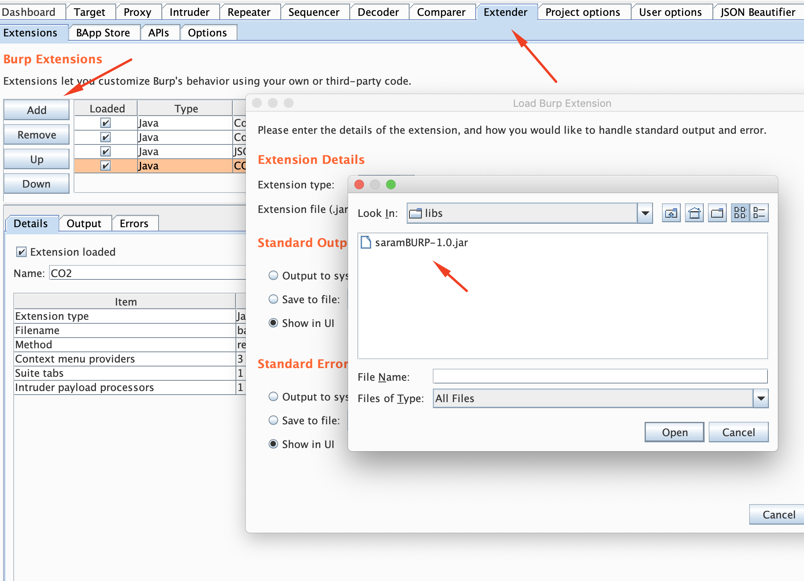
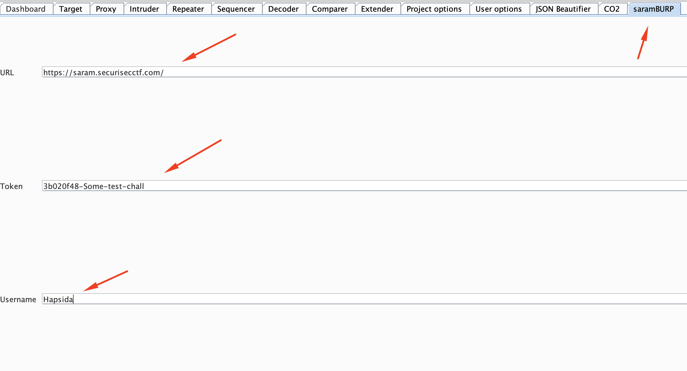
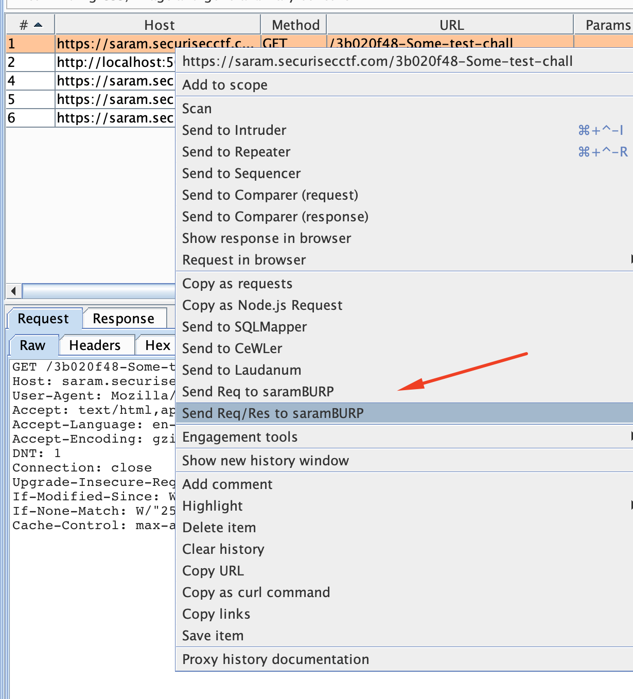

[](https://travis-ci.com/securisec/saramBURP)

# saramBURP

## Build
To build, use:
```
cd saramBURP
chmod +x gradlew
./gradlew customFatJar
```

Built version can be found inside `build/libs/`. It is a jar file called `saramBURP.jar`

## Released versions:
Download from [Github](https://github.com/securisec/saramBURP/releases) releases. 

## Install
Setup Burp Suite extension with the jar file:

- Load the jar file in Burp extensions
    

- Set the URL, Token and Username in the extension config window
    

- Right click on proxy and send either the `Request`, or both `Request/Response` to the **Saram** server
    

> The server will response the request if the response size is too big.