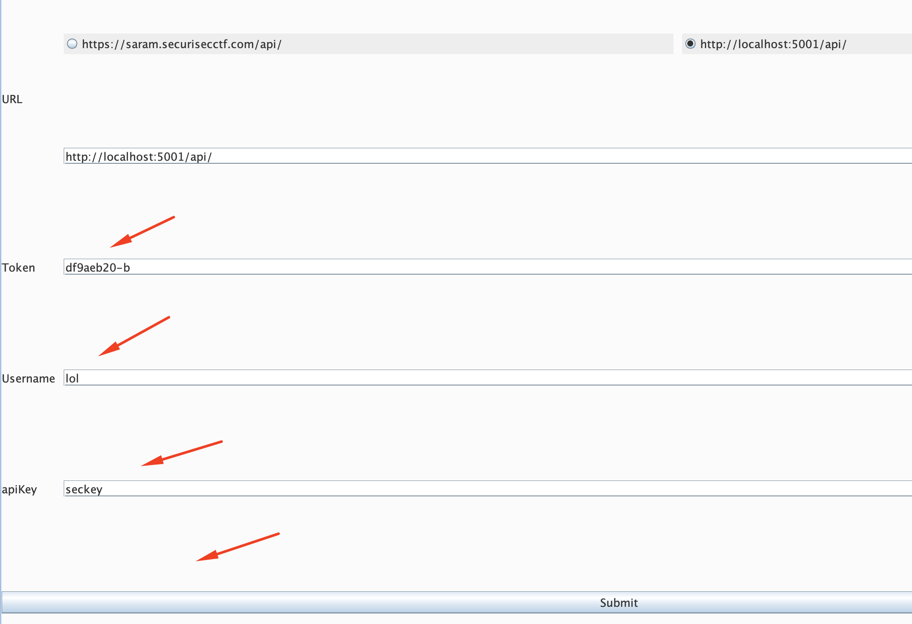

[](https://travis-ci.com/securisec/saramBURP)

# saramBURP

## Build
To build, use:
```
cd saramBURP
chmod +x gradlew
./gradlew customFatJar
```

## Install
Once the `.jar` file is built (inside `build/libs`), install in Burp Suite.

- Load the jar file in Burp extensions
    

- Set the URL, Token and Username in the extension config window
    

- Right click on proxy and send either the `Request`, or both `Request/Response` to the **Saram** server
    